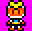

# Bài tập lớn OOP - Bomberman Game

Trong bài tập lớn này, nhiệm vụ của bạn là viết một phiên bản Java mô phỏng lại trò chơi [Bomberman](https://www.youtube.com/watch?v=mKIOVwqgSXM) kinh điển của NES.

Bạn có thể sử dụng mã nguồn tại repository này để phát triển hoặc tự phát triển từ đầu.

## Mô tả về các đối tượng trong trò chơi
Nếu bạn đã từng chơi Bomberman, bạn sẽ cảm thấy quen thuộc với những đối tượng này. Chúng được được chia làm hai loại chính là nhóm đối tượng động (*Bomber*, *Enemy*, *Bomb*) và nhóm đối tượng tĩnh (*Grass*, *Wall*, *Brick*, *Door*, *Item*).

*Hãy thiết kế hệ thống các đối tượng một cách phù hợp để tận dụng tối đa sức mạnh của OOP: tái sử dụng code, dễ dàng maintain.*

-  *Bomber* là nhân vật chính của trò chơi. Bomber có thể di chuyển theo 4 hướng trái/phải/lên/xuống theo sự điều khiển của người chơi. 
-  *Enemy* là các đối tượng mà Bomber phải tiêu diệt hết để có thể qua Level. Enemy có thể di chuyển ngẫu nhiên hoặc tự đuổi theo Bomber tùy theo loại Enemy. Các loại Enemy sẽ được mô tả cụ thể ở phần dưới.
-  *Bomb* là đối tượng mà Bomber sẽ đặt và kích hoạt tại các ô Grass. Khi đã được kích hoạt, Bomber và Enemy không thể di chuyển vào vị trí Bomb. Tuy nhiên ngay khi Bomber vừa đặt và kích hoạt Bomb tại ví trí của mình, Bomber có một lần được đi từ vị trí đặt Bomb ra vị trí bên cạnh. Sau khi kích hoạt 2s, Bomb sẽ tự nổ, các đối tượng *Flame*  được tạo ra.

-  *Grass* là đối tượng mà Bomber và Enemy có thể di chuyển xuyên qua, và cho phép đặt Bomb lên vị trí của nó
-  *Wall* là đối tượng cố định, không thể phá hủy bằng Bomb cũng như không thể đặt Bomb lên được, Bomber và Enemy không thể di chuyển vào đối tượng này
-  *Brick* là đối tượng được đặt lên các ô Grass, không cho phép đặt Bomb lên nhưng có thể bị phá hủy bởi Bomb được đặt gần đó. Bomber và Enemy thông thường không thể di chuyển vào vị trí Brick khi nó chưa bị phá hủy.

-  *Portal* là đối tượng được giấu phía sau một đối tượng Brick. Khi Brick đó bị phá hủy, Portal sẽ hiện ra và nếu tất cả Enemy đã bị tiêu diệt thì người chơi có thể qua Level khác bằng cách di chuyển vào vị trí của Portal.

Các *Item* cũng được giấu phía sau Brick và chỉ hiện ra khi Brick bị phá hủy. Bomber có thể sử dụng Item bằng cách di chuyển vào vị trí của Item. Thông tin về chức năng của các Item được liệt kê như dưới đây:
-  *SpeedItem* Khi sử dụng Item này, Bomber sẽ được tăng vận tốc di chuyển thêm một giá trị thích hợp
-  *FlameItem* Item này giúp tăng phạm vi ảnh hưởng của Bomb khi nổ (độ dài các Flame lớn hơn)
-  *BombItem* Thông thường, nếu không có đối tượng Bomb nào đang trong trạng thái kích hoạt, Bomber sẽ được đặt và kích hoạt duy nhất một đối tượng Bomb. Item này giúp tăng số lượng Bomb có thể đặt thêm một.
-  *KickBombItem* Item này giúp người chơi có khả năng đá quả bom đi theo 1 hướng cố định.
-  *LifeItem* Item này sẽ tăng số mạng của Player lên 1.

Có nhiều loại Enemy trong Bomberman, tuy nhiên trong phiên bản này chỉ yêu cầu cài đặt hai loại Enemy dưới đây (nếu cài đặt thêm các loại khác sẽ được cộng thêm điểm):
-  *Balloom* là Enemy đơn giản nhất, di chuyển ngẫu nhiên với vận tốc cố định
-  *Oneal* có thể đuổi theo Player khi gặp Player (biết đuổi theo Bomber)
-  *DOLL* có tốc độ di chuyển thay đổi, lúc nhanh, lúc chậm và di chuyển "thông minh" hơn so với Balloom 
-  *GHOST* ĐÂY LÀ CON QUÁI MẠNH NHẤT CÓ THỂ DI CHUYỂN XUYÊN ĐỊA HÌNH VÀ CÓ THỂ ĐUỔI THEO PLAYER NÓ CẦN ĐƯỢC ƯU TIÊN TIÊU DIỆT (biết đuổi theo Bomber)

## Mô tả game play, xử lý va chạm và xử lý bom nổ
- Trong một màn chơi, Bomber sẽ được người chơi di chuyển, đặt và kích hoạt Bomb với mục tiêu chính là tiêu diệt tất cả Enemy và tìm ra vị trí Portal để có thể qua màn mới
- Bomber sẽ bị giết khi va chạm với Enemy hoặc thuộc phạm vi Bomb nổ. Lúc đấy trò chơi kết thúc.
- Enemy bị tiêu diệt khi thuộc phạm vi Bomb nổ
- Một đối tượng thuộc phạm vi Bomb nổ có nghĩa là đối tượng đó va chạm với một trong các tia lửa được tạo ra tại thời điểm một đối tượng Bomb nổ.

- Khi Bomb nổ, một Flame trung tâm tại vị trí Bomb nổ và bốn Flame tại bốn vị trí ô đơn vị xung quanh vị trí của Bomb xuất hiện theo bốn hướng trên/dưới/trái/phải. Độ dài bốn Flame xung quanh mặc định là 1 đơn vị, được tăng lên khi Bomber sử dụng các FlameItem.
- Khi các Flame xuất hiện, nếu có một đối tượng thuộc loại Brick/Wall nằm trên vị trí một trong các Flame thì độ dài Flame đó sẽ được giảm đi để sao cho Flame chỉ xuất hiện đến vị trí đối tượng Brick/Wall theo hướng xuất hiện. Lúc đó chỉ có đối tượng Brick/Wall bị ảnh hưởng bởi Flame, các đối tượng tiếp theo không bị ảnh hưởng. Còn nếu vật cản Flame là một đối tượng Bomb khác thì đối tượng Bomb đó cũng sẽ nổ ngay lập tức.

## Mô tả starter project
Xem comment ở starter project

## Yêu cầu chung
- Có thể chơi được ít nhất cho một màn chơi (chiến thắng một màn chơi)
- Có thể thay đổi được tệp cấu hình khác cho màn chơi (tương tự mẫu cho trước)

## Nhiệm vụ của bạn

### 1. Thiết kế (3 điểm):
*   **Sơ đồ lớp (Class Diagram):** Vẽ sơ đồ lớp UML thể hiện mối quan hệ giữa các lớp (sử dụng công cụ như draw.io, PlantUML, Lucidchart...). Sơ đồ phải thể hiện rõ:
    *   Các lớp đối tượng (Bomber, Enemy, Balloom, Oneal, Bomb, Flame, Grass, Wall, Brick, Portal, Item, SpeedItem, FlameItem, BombItem...).
    *   Thuộc tính (attributes) và phương thức (methods) của mỗi lớp.
    *   Quan hệ kế thừa (inheritance), kết hợp (association), phụ thuộc (dependency) giữa các lớp.
*   **Thiết kế giao diện (nếu có):** Mô tả hoặc phác thảo giao diện người dùng (nếu chọn làm phần đồ họa).
*   **Giải thích:** Giải thích ngắn gọn về thiết kế, lý do lựa chọn các lớp, quan hệ, và các design pattern (nếu có sử dụng, ví dụ: Factory, Strategy...).

### 2. Cài đặt (5 điểm):
*   **Cấu trúc chương trình:**
    *   Tổ chức code thành các package hợp lý (ví dụ: entities, graphics, input, level, game).
    *   Sử dụng các hằng số (constants) để lưu trữ các giá trị cố định (ví dụ: kích thước ô, thời gian nổ bom...).
*   **Đọc màn chơi:**
    *   Đọc dữ liệu màn chơi từ file text (ví dụ: Level1.txt).
    *   Tạo các đối tượng tương ứng trong game dựa trên dữ liệu đọc được.
*   **Điều khiển:**
    *   Cho phép người chơi điều khiển Bomber di chuyển bằng các phím mũi tên hoặc WASD.
    *   Cho phép Bomber đặt bom bằng phím Space.
*   **Xử lý logic:**
    *   Enemy di chuyển tự động (Balloom di chuyển ngẫu nhiên, Oneal có thể đuổi theo Bomber).
    *   Xử lý va chạm (collision detection):
        *   Bomber không thể đi xuyên Wall, Brick.
        *   Enemy không thể đi xuyên Wall, Brick (trước khi Brick bị phá).
        *   Bomber và Enemy chết khi va chạm với Flame.
        *   Bomber nhặt Item khi đi vào vị trí Item.
        *   Bomber đi vào Portal khi tất cả Enemy đã bị tiêu diệt.
    *   Xử lý bom nổ:
        *   Bom nổ sau một khoảng thời gian nhất định.
        *   Tạo ra các Flame theo 4 hướng.
        *   Flame bị chặn bởi Wall, Brick. Nếu là Brick thì Brick sẽ bị phá hủy.
        *   Nếu Flame chạm vào Bomb khác, Bomb đó cũng sẽ nổ ngay lập tức.
    *   Cập nhật trạng thái các đối tượng sau mỗi frame (vòng lặp game).
*   **Hiển thị:**
    *   Vẽ các đối tượng lên màn hình (sử dụng thư viện đồ họa của starter code, hoặc tự xây dựng).
    *   Cập nhật màn hình sau mỗi frame.
    *   Có thể hiển thị thông tin về màn chơi, điểm số, số lượng mạng còn lại (tùy chọn).
### 3. Mở rộng (2 điểm):
Chọn ít nhất một trong các tính năng sau để mở rộng game:
*   **Thêm loại Enemy:** Tạo thêm ít nhất một loại Enemy mới với hành vi khác biệt (ví dụ: di chuyển nhanh hơn, có khả năng đặc biệt...).
*   **Thêm Item:** Tạo thêm ít nhất một loại Item mới với chức năng khác biệt (ví dụ: tàng hình, xuyên tường...).
*   **Nhiều màn chơi:** Cho phép chuyển đổi giữa các màn chơi khác nhau (đọc từ các file khác nhau).
*   **Âm thanh:** Thêm âm thanh cho các sự kiện (ví dụ: đặt bom, bom nổ, Enemy chết, nhặt Item...).
*   **Điểm số:** Tính điểm khi tiêu diệt Enemy, hiển thị điểm số.
*   **Lưu/Tải game:** Cho phép lưu trạng thái game và tải lại sau này (sử dụng file).
*   **AI cho Bomber (cho phép máy tự động chơi)**
*   **Chế độ nhiều người chơi:** Phát triển hệ thống server-client để nhiều người chơi cùng lúc qua mạng LAN hoặc Internet.
*   **Giao diện đồ hoạ (GUI):** Thay vì giao diện text, hãy tạo một giao diện đồ hoạ thân thiện với các button, menu. Có thể dùng JavaFX hoặc thư viện khác.
*   **Tối ưu hoá hiệu suất:** Tìm các điểm có thể tối ưu, ví dụ:
    *   Dùng thuật toán tìm đường tốt hơn cho Oneal (A\*, BFS, DFS...)
    *   Tối ưu việc render các đối tượng.

